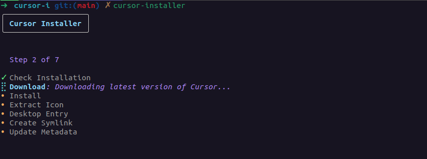

# Cursor Installer

Cursor Installer is a CLI tool designed to streamline the installation of the Cursor editor on Linux systems. It provides a user-friendly interface for downloading, installing, and managing the Cursor editor, handling everything from desktop integration to version management.



## Table of Contents

- [Cursor Installer](#cursor-installer)
  - [Table of Contents](#table-of-contents)
  - [Installation](#installation)
  - [Usage](#usage)
    - [Standard Installation](#standard-installation)
    - [Download-Only Mode](#download-only-mode)
  - [Features](#features)
  - [Project Structure](#project-structure)
  - [Development](#development)
    - [Required Dependencies](#required-dependencies)
  - [Contributing](#contributing)
  - [License](#license)

## Installation

To install Cursor Installer, you need to have Go installed on your system. Then, you can use the following command:

```bash
go install github.com/lutefd/cursor-installer@latest
```

Alternatively, you can clone the repository and build it manually:

```bash
git clone https://github.com/lutefd/cursor-installer.git
cd cursor-installer
make build
```

## Usage

Cursor Installer provides both standard and download-only installation modes.

### Standard Installation

```bash
cursor-installer [flags]
```

You can use the following flags:

Flags:

- `-d, --download-only`: Only download Cursor without installing
- `-f, --force`: Force installation even if Cursor is already installed
- `-h, --help`: Display help for cursor-installer

### Download-Only Mode

To download without installing:

```bash
cursor-installer --download-only
```

Or

```bash
cursor-installer -d
```

## Features

- Interactive installation progress UI
- Version management and updates
- Desktop integration
- System-wide installation in `/opt`
- Automatic desktop entry creation
- Command-line accessibility via symlink
- Update checking and version tracking
- Force installation option for reinstalls

## Project Structure

The project is organized as follows:

```
cursor-installer/
├── cmd/
│   └── cursor-installer/
│       └── main.go
├── internal/
│   ├── app/
│   │   ├── app.go
│   │   └── metadata.go
│   ├── cli/
│   │   └── cli.go
│   └── ui/
│       └── ui.go
├── .gitignore
├── go.mod
├── go.sum
├── LICENSE
└── README.md
```

- `cmd/cursor-installer`: Contains the main entry point of the application
- `internal/app`: Implements core installation functionality and metadata management
- `internal/cli`: Handles command-line interface using Cobra
- `internal/ui`: Implements the interactive UI using Bubble Tea

## Development

To set up the development environment, follow these steps:

1. Clone the repository:

   ```bash
   git clone https://github.com/lutefd/cursor-installer.git
   cd cursor-installer
   ```

2. Install dependencies:

   ```bash
   go mod download
   ```

3. Build the project:

   ```bash
   go build ./cmd/cursor-installer
   ```

4. Run tests:
   ```bash
   go test ./...
   ```

### Required Dependencies

- Go 1.23.1 or later
- Linux operating system
- Root privileges (for installation)

## Contributing

Contributions to Cursor Installer are welcome! Here are some ways you can contribute:

1. Report bugs or request features by opening an issue
2. Improve documentation
3. Submit pull requests with bug fixes or new features

Please ensure that your code adheres to the existing style and includes appropriate tests before submitting a pull request.

## License

Cursor Installer is open-source software licensed under the MIT license. See the [LICENSE](LICENSE) file for more details.
